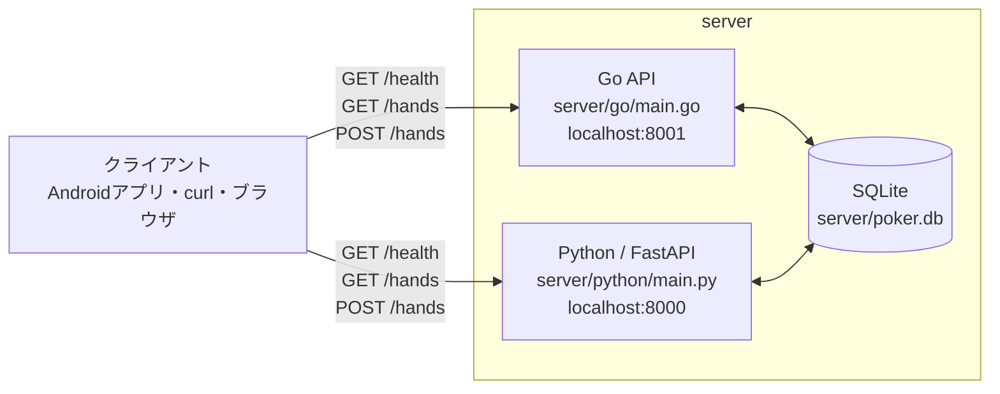

# ポーカー記録システム（server）

このディレクトリには、同じポーカー記録 API の Go 版と Python 版があります。APIのエンドポイントとSQLiteのデータ形式は共通です。

## システム構成



クライアントは Go版またはPython版のどちらか一方へ HTTP リクエストを送ります。両実装は同じ SQLite データベースを読み書きするため、保存されるハンドのデータは共通です。

| 実装 | ソース | 起動URL | APIドキュメント |
| --- | --- | --- | --- |
| Go | `go/` | `http://localhost:8001` | なし |
| Python / FastAPI | `python/` | `http://localhost:8000` | `http://localhost:8000/docs` |

2つの実装は `poker.db` を共有しています。Go版で保存したハンドは Python版からも取得でき、その逆も同様です。ポートが異なるため、両方を同時に起動して比較できます。

## Go 版

### 必要なもの

- Go 1.27 以上

### 起動する

```bash
cd all-in-sight/server/go
go run .
```

初回起動時は、`go.mod` に記載された SQLite ドライバなどの依存関係が自動でダウンロードされます。

起動後、次のコマンドで確認します。

```bash
curl http://localhost:8001/health
```

以下が返れば成功です。

```json
{"status":"ok"}
```

### テストを実行する

```bash
cd all-in-sight/server/go
go test -v ./...
```

## Python 版

### 必要なもの

- Python 3.10 以上
- pip

### 初回セットアップと起動

```bash
cd all-in-sight/server/python
python3 -m venv .venv
source .venv/bin/activate
pip install -r requirements.txt
uvicorn main:app --reload --port 8000
```

起動後はブラウザで `http://localhost:8000/docs` を開くと、Swagger UI から API を試せます。ヘルスチェックは次のコマンドでも確認できます。

```bash
curl http://localhost:8000/health
```

## コマンドラインから API を使う

サーバーを起動したまま、別のターミナルから `curl` を実行します。Go版を使う場合は次を実行します。

```bash
API_URL=http://localhost:8001
```

Python版を使う場合は次を実行します。

```bash
API_URL=http://localhost:8000
```

### 1. GET: サーバーの状態を確認する

```bash
curl "$API_URL/health"
```

次のように返ればサーバーは起動しています。

```json
{"status":"ok"}
```

### 2. POST: ハンドを記録する

```bash
curl -i -X POST "$API_URL/hands" \
  -H 'Content-Type: application/json' \
  -d '{"cards":[{"rank":"A","suit":"s"},{"rank":"K","suit":"h"}]}'
```

`-i` はレスポンスの HTTP ステータスも表示するオプションです。成功すると `HTTP/1.1 201 Created` と、保存されたハンドが返ります。

```json
{"id":1,"cards":[{"rank":"A","suit":"s"},{"rank":"K","suit":"h"}],"created_at":"2026-09-06T12:00:00Z"}
```

`created_at` の値は実行時刻、`id` の値はデータベースの状態によって変わります。

### 3. GET: 保存済みハンドの一覧を取得する

```bash
curl "$API_URL/hands"
```

新しいハンドから順に JSON 配列で返ります。

```json
[{"id":1,"cards":[{"rank":"A","suit":"s"},{"rank":"K","suit":"h"}],"created_at":"2026-09-06T12:00:00Z"}]
```

## API 共通仕様

### ハンドを記録する

`POST /hands` にカード2枚を送信します。以下は Go版の例です。Python版を使う場合はポート番号を `8000` に変更してください。

```bash
curl -X POST http://localhost:8001/hands \
  -H 'Content-Type: application/json' \
  -d '{"cards":[{"rank":"A","suit":"s"},{"rank":"K","suit":"h"}]}'
```

成功時は `201 Created` とともに、保存されたハンド、ID、作成日時が返ります。

### ハンド一覧を取得する

```bash
curl http://localhost:8001/hands
```

Python版を使う場合:

```bash
curl http://localhost:8000/hands
```

### 入力ルール

- `cards` は必ず2枚です。
- `rank` は `2` から `9`、`T`、`J`、`Q`、`K`、`A` のいずれかです。
- `suit` は `s`、`h`、`d`、`c` のいずれかです。

不正な入力には `422 Unprocessable Entity` が返ります。

## ディレクトリ構成

```text
server/
|- go/                 # Go の実装
|  |- go.mod
|  |- go.sum
|  |- main.go
|  `- main_test.go
|- python/             # Python / FastAPI の実装
|  |- main.py
|  `- requirements.txt
|- poker.db            # 両実装で共有する SQLite データベース
`- README.md
```

## サーバーを停止する

起動中のターミナルで `Ctrl + C` を押します。

## データベースを初期化する

Go版とPython版をどちらも停止した後、`server` ディレクトリで次を実行します。次回のサーバー起動時に空のデータベースとテーブルが作成されます。

```bash
rm poker.db
```
